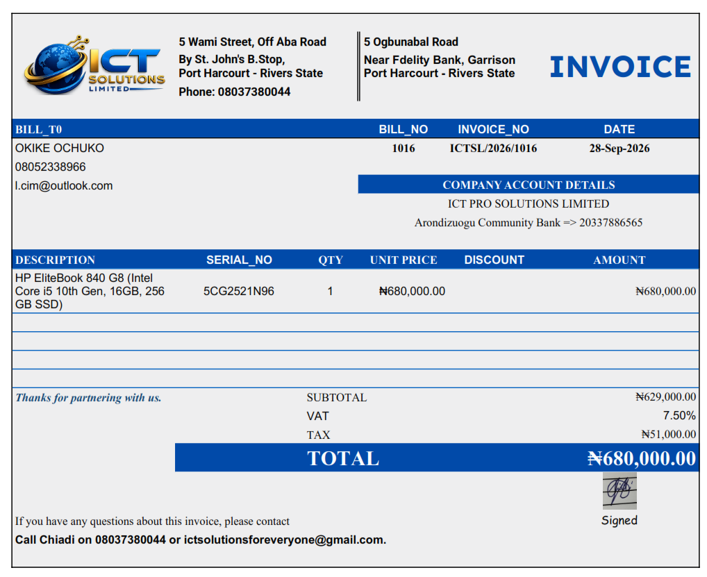
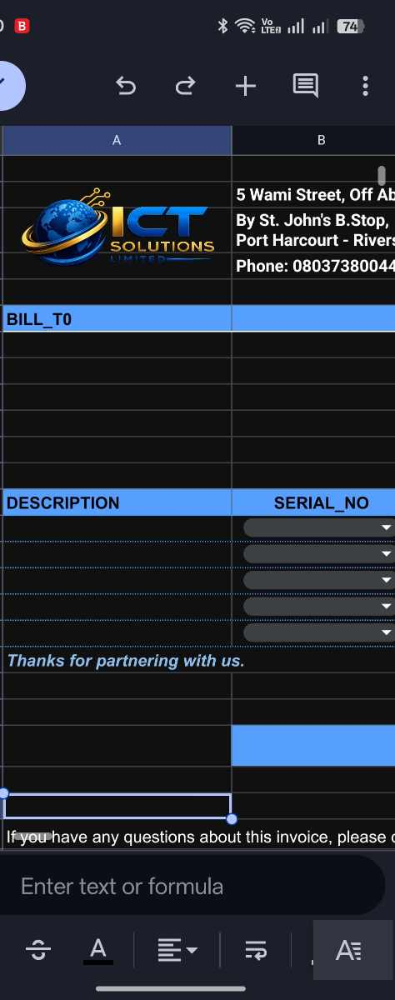
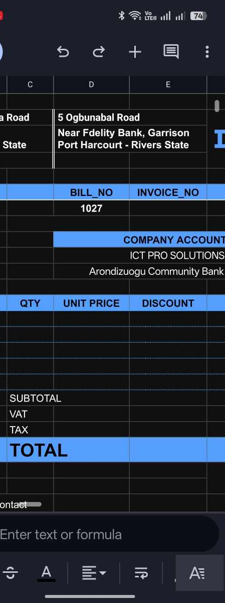

# ICTSL Automated Invoice Dispatcher (Google Sheets & Apps Script)

An automated, mobile-friendly invoicing and inventory logging system built on Google Sheets and Google Apps Script. Designed for **ICT Solutions Limited (ICTSL)**, this solution streamlines invoice PDF generation, automated email dispatching, sales logging, and real-time inventory tracking directly from a desktop browser or the Google Sheets Android app.

---

## Key Features

* **Mobile-Ready Trigger**: Uses a native sheet **Tick box (Cell `H1`)** paired with an installable `On edit` trigger to dispatch invoices directly from Android devices without desktop interaction.
* **Desktop Custom Menu**: Integrates a custom top-bar menu (`Invoice System > Send Invoice`) and drawing buttons for desktop workflows.
* **Automated Data Validation**: Built-in validation formula in **Cell `G1`** verifies valid customer email formatting and ensures all selected items are marked as `"Available"` in inventory before sending.
* **PDF Generation & Storage**: Renders formatted A4 single-page invoice PDFs, saves them to a designated Google Drive folder, and attaches them to outbound customer emails.
* **Automated Inventory Updates**: Automatically marks selected serial numbers as `"Sold"` in the `INVENTORY` tab upon successful dispatch.
* **Sales Logging & Auto-Increment**: Appends transaction records to `SALES_LOG` and automatically increments bill numbers for the next transaction.

---

## System Overview & Mobile Flow

### Mobile Dispatch Flow
1. Open the **Google Sheets App** on Android.
2. Select line items via serial numbers in cells `B14:B18` and enter customer details.
3. Confirm cell `G1` reads **`OK`**.
4. Tap the **Tick Box (Cell `H1`)**.
5. The system automatically sends the email with the attached PDF, logs the sale, marks inventory items as `"Sold"`, resets the form, and unchecks cell `H1`.

---

## Visual Demonstration

### Sample Invoice Output


### Mobile Workflow Demo


---

## Trigger Mechanisms

| Trigger Method | Interface | Execution Mechanism | Setup Required |
| :--- | :--- | :--- | :--- |
| **Tick Box (Cell `H1`)** | Mobile & Desktop | `installedOnEdit(e)` | Installable Trigger (`On edit`) |
| **Custom Menu** | Desktop Browser | `Invoice System > Send Invoice` | `onOpen()` Menu Script |
| **Drawing Button** | Desktop Browser | Assigned Script: `generateAndDispatchInvoice` | Drawing Object |

---

## Repository Structure

```text
├── README.md               # Project overview and visual demonstration
├── SETUP_GUIDE.md          # Complete workbook setup, formulas, and headers guide
└── Code.gs                 # Complete Google Apps Script source code