### File 2: `SETUP_GUIDE.md`

# Workbook Setup & Formula Reference Guide

This guide details the step-by-step creation of the Google Sheet workbook required for the ICTSL Invoice Dispatcher system.

---

## 1. Sheet: `INVOICE_GENERATOR`

This sheet serves as the primary data entry interface and customer receipt layout.

### Cell Formatting & Inputs
* **Cell A7**: Customer Name (Text)
* **Cell A8**: Customer Phone Number (Text/Number)
* **Cell A9**: Customer Email Address (Valid email format: `name@domain.com`)
* **Cell D7**: Bill Number (`BILL_NO`)
* **Cell E7**: Invoice Number (`INVOICE_NO`)
* **Cell F7**: Date (`DATE`)
* **Range B14:B18**: Item Serial Numbers (Selection or Manual Entry)
* **Range C14:C18**: Quantity (Defaults to `1` if left blank)
* **Range E14:E18**: Discount Amount per item (Optional)
* **Cell H1**: Insert **Tick box** (Go to `Insert > Tick box`)

---

### Cell Formulas

#### Cell G1 (Validation Status Formula)
Ensures customer email is valid and all selected items are available in inventory:
```excel
=IF(AND(A9<>"", ISNUMBER(MATCH("*@*.*", A9, 0)), COUNTA(B14:B18)>0, COUNTIF(B14:B18, "") + SUMPRODUCT(--(ISNUMBER(MATCH(B14:B18, FILTER(INVENTORY!A2:A, INVENTORY!J2:J="Available"), 0)))) = 5), "OK", "NOT_READY") ```

Line Items Table (Rows 14 to 18)
Apply these formulas across rows 14 through 18 (replace 14 with the respective row number):

Column A (Description - Cell A14):
```
=IF(ISBLANK(B14), "", IFERROR(VLOOKUP(B14, INVENTORY!A2:J, 2, FALSE) & " " & VLOOKUP(B14, INVENTORY!A2:J, 3, FALSE) & " (" & VLOOKUP(B14, INVENTORY!A2:J, 4, FALSE) & ", " & VLOOKUP(B14, INVENTORY!A2:J, 6, FALSE) & ", " & VLOOKUP(B14, INVENTORY!A2:J, 7, FALSE) & ")", "Item Not Found"))
```
Column D (Unit Price - Cell D14):
```
=IF(ISBLANK(B14), "", IFERROR(VALUE(SUBSTITUTE(SUBSTITUTE(VLOOKUP(B14, INVENTORY!A2:J, 9, FALSE), "₦", ""), ",", "")), 0))
```
Column F (Total Amount - Cell F14):
```
=IF(OR(ISBLANK(B14), D14=""), "", ((IF(C14="", 1, C14)) * D14) - IF(E14="", 0, E14))
```
Financial Summaries
Cell F19 (Subtotal):
```
=IF(OR(F22="",F21=""), "", F22 - F21)
```
Cell F21 (VAT - 7.5%):
```
=IF(F22="", "", ROUND(F22 * 0.075, 2))
```
Cell F22 (Grand Total):
```
=IF(SUM(F14:F18)=0, "", SUM(F14:F18))
```
2. Sheet: INVENTORY
Stores stock inventory records and availability statuses.

### Table Headers (Row 1)

| Column | Header Name | Description |
| :--- | :--- | :--- |
| **A** | `SERIAL_NO` | Unique hardware serial number |
| **B** | `BRAND` | Laptop/Device Manufacturer |
| **C** | `MODEL` | Model Name/Number |
| **D** | `PROCESSOR` | CPU specifications |
| **E** | `GENERATION` | Hardware Generation |
| **F** | `RAM` | Installed RAM |
| **G** | `STORAGE` | Storage capacity and type |
| **H** | `CONDITION` | Grade/Condition |
| **I** | `PRICE` | Unit Price |
| **J** | `STATUS` | Availability Status (`Available` or `Sold`) |


3. Sheet: SALES_LOG
Stores processed sales records appended by Apps Script.

### Table Headers (Row 1)

| Column | Header Name |
| :--- | :--- |
| **A** | `CUSTOMER_NAME` |
| **B** | `PHONE` |
| **C** | `EMAIL` |
| **D** | `DATE` |
| **E** | `INVOICE_NO` |
| **F** | `BILL_NO` |
| **G** | `SERIAL_NUMBERS` |
| **H** | `ITEM_DESCRIPTIONS` |
| **I** | `SUBTOTAL` |
| **J** | `VAT` |
| **K** | `GRAND_TOTAL` |
| **L** | `PDF_DRIVE_URL` |

4. UI Elements Setup
A. Mobile Tick Box
Select cell H1 on INVOICE_GENERATOR.

Click Insert > Tick box.

Add label in H2 or adjacent cell indicating SEND INVOICE. See image below.
<p align="center">
  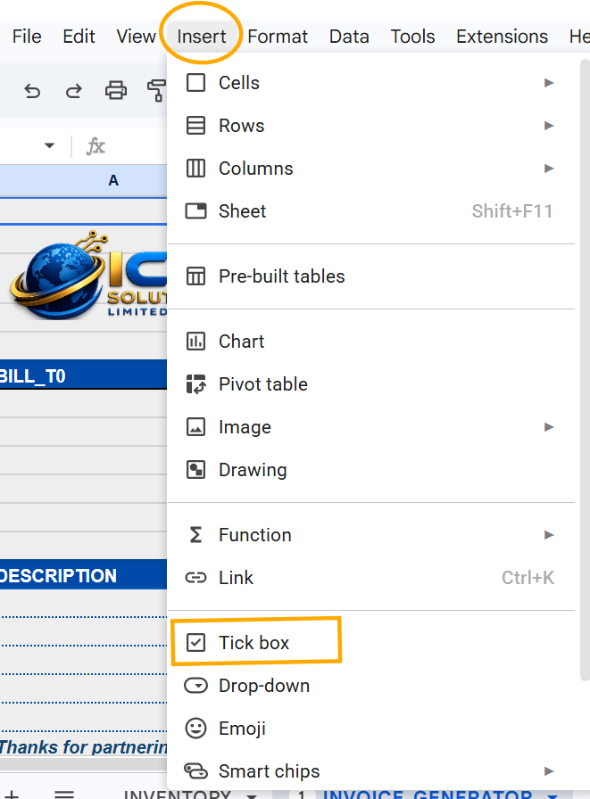
  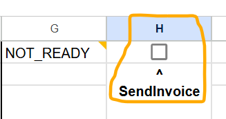
</p>

B. Desktop Button (Drawing)
Go to Insert > Drawing.

Draw a rectangle shape, style it, and add text: "SEND INVOICE".

Click Save and Close.

Click the three dots menu (⋮) on the top-right of the drawing object.
<p>
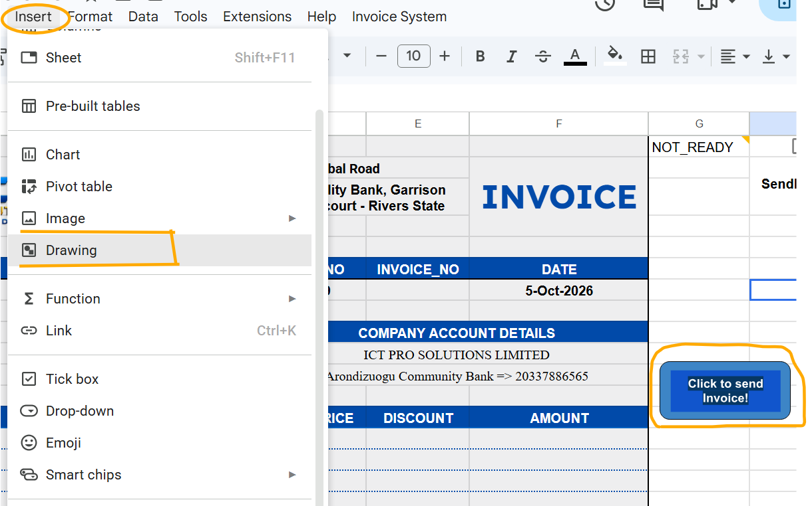
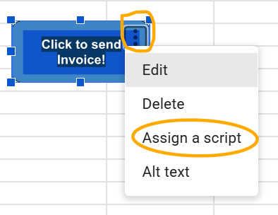
</p>

Click Assign script and enter: generateAndDispatchInvoice.
Done

Next, take a look at the Apps Script file, code.gs. 
Code Architecture Explanation
onOpen(): Runs automatically when the spreadsheet is opened in a desktop web browser to inject a UI menu (Invoice System > Send Invoice).

installedOnEdit(e): Serves as the listener for an Installable On edit trigger. It detects when cell H1 on INVOICE_GENERATOR changes to TRUE. Using an installable trigger bypasses security limitations imposed on simple triggers, granting authorization for GmailApp and DriveApp.

generateAndDispatchInvoice():

Evaluates validation cell G1. If G1 !== "OK", execution halts.

Compiles inventory data, generates an incremental invoice ID (ICTSL/YYYY/BILL_NO), and exports rows 0–23 / columns A–F into an A4 PDF blob via UrlFetchApp.

Sends the PDF attachment via GmailApp and stores a copy in Google Drive.

Updates inventory item statuses to "Sold" in INVENTORY!J:J and logs sales metadata into SALES_LOG.

Clears form inputs, re-applies formula strings to prevent breaking sheet bindings, and unchecks cell H1.

---

## 5. Setting Up Google Apps Script

Follow these steps to deploy the backend automation script and authorize necessary permissions.

### A. Access Apps Script Editor
1. Open your Google Spreadsheet in a web browser.
2. In the top menu, click **Extensions > Apps Script**. Select your Google account or sign in.

<p align="center">
  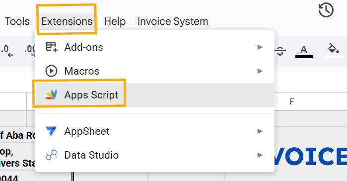
</p>

3. Clear any default code in the editor tab (`Code.gs`).

### B. Paste and Configure the Code
1. Copy the contents of `code.gs` from this repository.
2. Paste the code into the Apps Script editor.
3. Replace the placeholder value in `DRIVE_FOLDER_ID` with your target Google Drive folder ID:

    const DRIVE_FOLDER_ID = "1Fh_CsckWmws5cXQdei9Ylj2xQUUXh4ZZ"; // Example ID

<p align="center">
  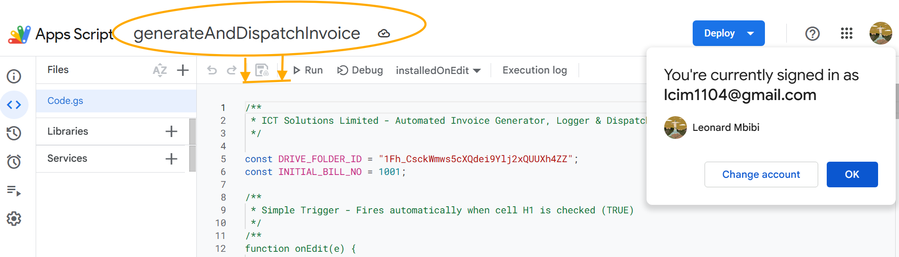
</p>

---

## 6. Configuring the Installable Trigger (Mobile Dispatch)

An installable trigger is required so that ticking cell **`H1`** on mobile can execute email and PDF services without hitting Google's simple trigger security blocks.

1. In the Apps Script left sidebar, click the **Triggers** icon (looks like an alarm clock ⏰).
2. Click **+ Add Trigger** in the bottom-right corner.

<p align="center">
  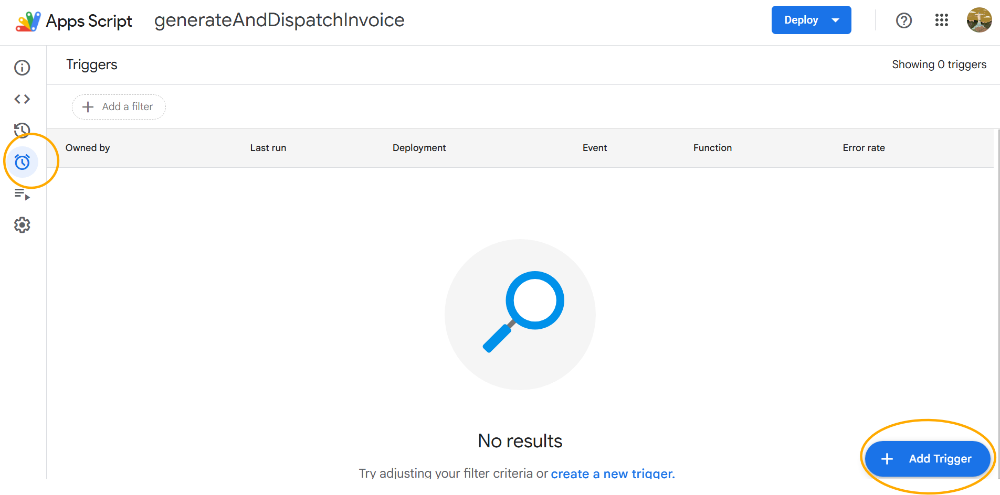
</p>

3. Configure the trigger parameters:
   * **Choose which function to run**: `installedOnEdit`
   * **Choose which deployment should run**: `Head`
   * **Select event source**: `From spreadsheet`
   * **Select event type**: `On edit`
4. Click **Save**.

<p align="center">
  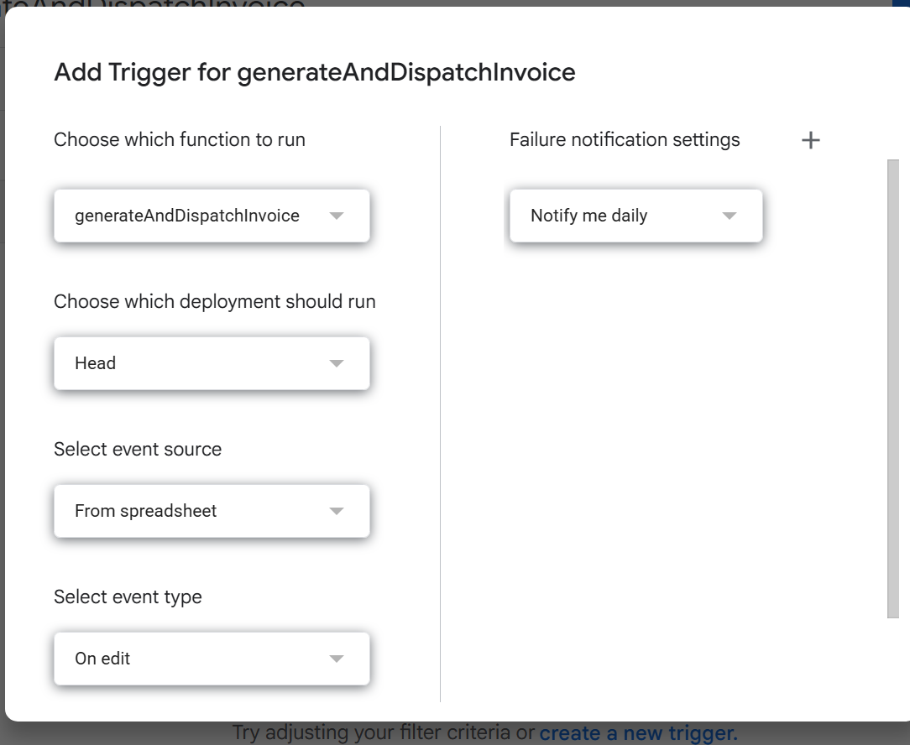
</p>

---

## 7. Granting OAuth Permissions

When saving the trigger or running a function for the first time, Google will require OAuth authorization:

<p align="center">
  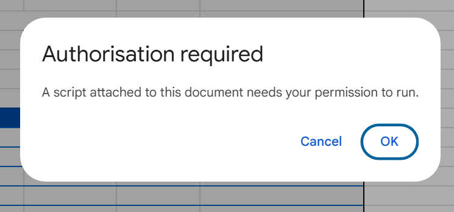
</p>

1. A popup window titled **"Choose an account"** will appear. Select your Google account.
2. When prompted with **"Google hasn't verified this app"**, click **Advanced**.
3. Click **Go to Untitled project (unsafe)** (or your project's custom name).

<p align="center">
  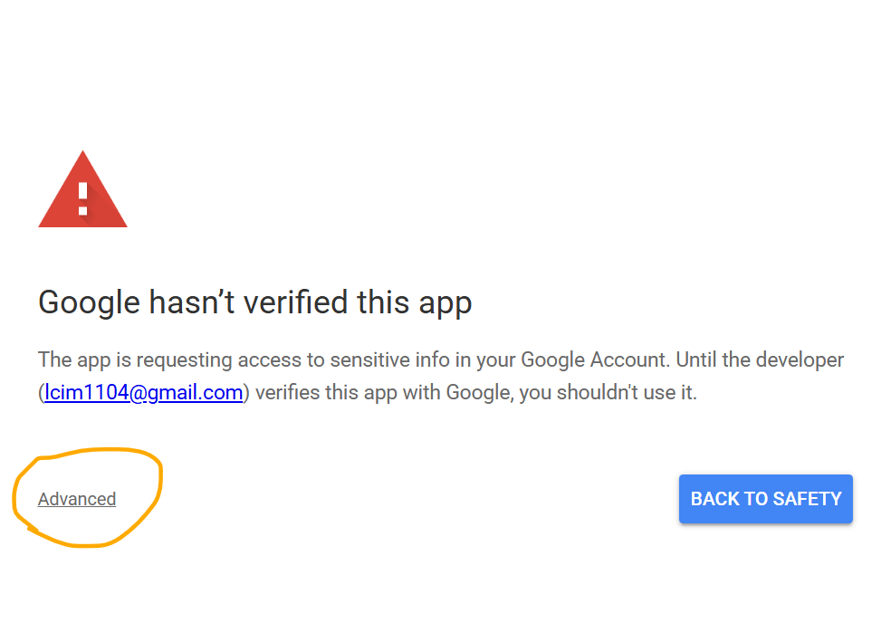
  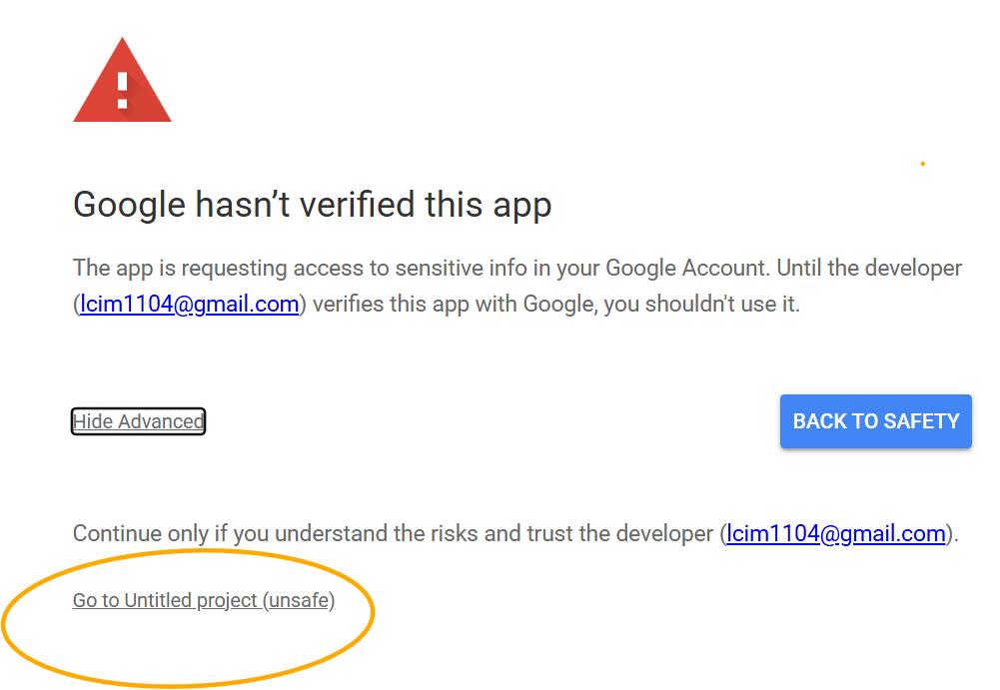
</p>

4. Review the requested permissions (`GmailApp`, `DriveApp`, `SpreadsheetApp`) and click **Allow**.

<p align="center">
  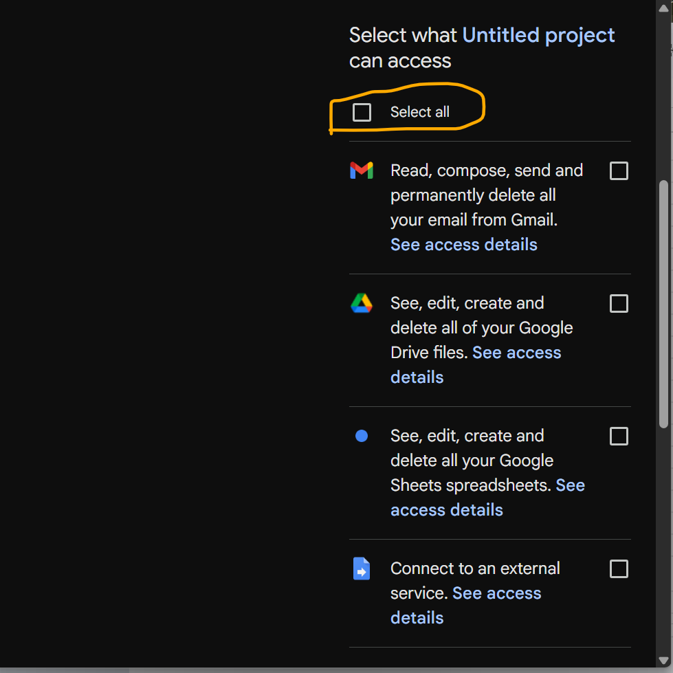
</p>

---

## 8. Final Testing

### Mobile Testing (Android)
1. Open the **Google Sheets App** on your mobile device.
2. Fill out invoice line items and customer details on `INVOICE_GENERATOR`.
3. Confirm cell `G1` displays **`OK`**.
4. Check cell **`H1`** (Tick Box).
5. Verify the script generates the PDF, dispatches the email via Gmail, updates `INVENTORY` item statuses to `"Sold"`, logs the transaction in `SALES_LOG`, and resets cell `H1` to unchecked.

### Desktop Testing
* In your spreadsheet, click **Invoice System > Send Invoice** from the top menu, or click the assigned **SEND INVOICE** drawing button.

If it runs successfully, it displays:

<p align="center">
  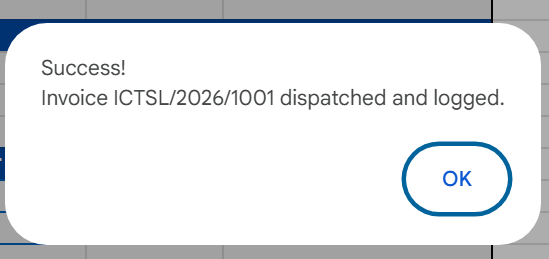
</p>

Else, it displays the appropriate error message.